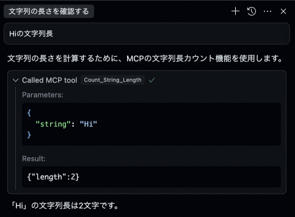

# learn-fastmcp-mastra
fastmcp(+mastra)を手を動かして理解するためのRepository

> ref. https://github.com/punkpeye/fastmcp

# 環境

- deno: 2.2.9

# MCPの使用手順
denoをglobalから実行できる状態になっていれば、各種MCPクライアントに以下の定義を記載することで自動的にMCPサーバーを起動できる。

## Cursorでの設定例

MCP:

```json
{
    "mcpServers": {

        "count-string-length": {
            "command": "deno",
            "args": [
                "run",
                "--allow-all",
                "/path/learn-fastmcp-mastra/packages/mcpserver/src/count-string-length/index.ts"
            ]
        }
    }
}
```

Cursor Agent での利用イメージ:


## メモ

### denoのインストール(asdf経由)

```
asdf plugin-add deno https://github.com/asdf-community/asdf-deno.git
asdf install deno 2.2.9
asdf global deno 2.2.9
```
## 参考
- https://zenn.dev/heavenosk/articles/fastmcp-simple-server